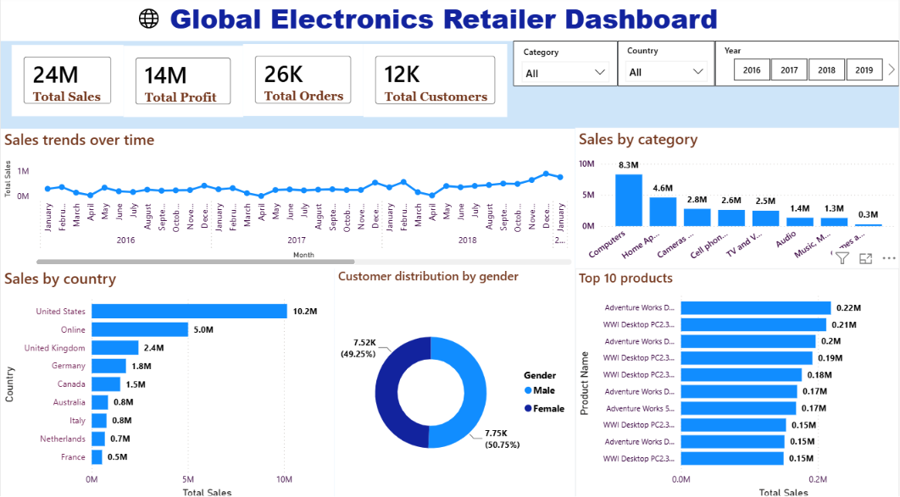

# 📊 Global Electronics Retailer Dashboard

An end-to-end Power BI Business Intelligence solution designed to analyze sales performance, profitability, customer behavior, product trends, and regional performance through interactive visualizations.

---

## 📸 Dashboard Preview

---

## 🎯 Project Objectives

* Analyze overall business performance using KPIs.
* Identify top-performing product categories.
* Evaluate country-wise sales performance.
* Analyze sales trends over time.
* Identify top-selling products.
* Understand customer demographics.

---

## 🛠 Tools & Technologies

* Power BI Desktop
* Power Query
* DAX
* Data Modeling
* Excel / CSV

---

## 📈 Key Insights

* Generated **$24M Sales** and **$14M Profit**.
* Processed **26K Orders** from **12K Customers**.
* **Computers** emerged as the highest revenue-generating category.
* **United States** recorded the highest sales contribution.
* Sales peaks were observed during **May** and **December**.
* Customer distribution was almost evenly split between male and female customers.

---

## 💡 Business Recommendations

* Increase focus on high-performing computer products.
* Expand successful desktop PC product lines.
* Improve sales strategies for low-performing categories.
* Leverage seasonal demand during peak sales months.

---

## 📂 Dataset

The dashboard was built using:

* Customers
* Products
* Sales
* Stores
* Exchange Rates

---

## 👨‍💻 Author

**Janani Tamilselvan**
Aspiring Data Analyst | Power BI Developer
